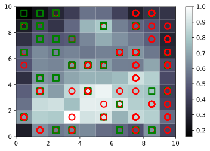

### We have detatils of customer and their multidimentional features, the goal is to reduce   
### features dimentionality to 2 and then classify as the customer was a potential  
### fraud or not.


```python
import numpy as np
import matplotlib.pyplot as plt
import pandas as pd
```


```python
dataset = pd.read_csv('Credit_Card_Applications.csv')
dataset
```


<div>
<style scoped>
    .dataframe tbody tr th:only-of-type {
        vertical-align: middle;
    }

    .dataframe tbody tr th {
        vertical-align: top;
    }

    .dataframe thead th {
        text-align: right;
    }
</style>
<table border="1" class="dataframe">
  <thead>
    <tr style="text-align: right;">
      <th></th>
      <th>CustomerID</th>
      <th>A1</th>
      <th>A2</th>
      <th>A3</th>
      <th>A4</th>
      <th>A5</th>
      <th>A6</th>
      <th>A7</th>
      <th>A8</th>
      <th>A9</th>
      <th>A10</th>
      <th>A11</th>
      <th>A12</th>
      <th>A13</th>
      <th>A14</th>
      <th>Class</th>
    </tr>
  </thead>
  <tbody>
    <tr>
      <th>0</th>
      <td>15776156</td>
      <td>1</td>
      <td>22.08</td>
      <td>11.460</td>
      <td>2</td>
      <td>4</td>
      <td>4</td>
      <td>1.585</td>
      <td>0</td>
      <td>0</td>
      <td>0</td>
      <td>1</td>
      <td>2</td>
      <td>100</td>
      <td>1213</td>
      <td>0</td>
    </tr>
    <tr>
      <th>1</th>
      <td>15739548</td>
      <td>0</td>
      <td>22.67</td>
      <td>7.000</td>
      <td>2</td>
      <td>8</td>
      <td>4</td>
      <td>0.165</td>
      <td>0</td>
      <td>0</td>
      <td>0</td>
      <td>0</td>
      <td>2</td>
      <td>160</td>
      <td>1</td>
      <td>0</td>
    </tr>
    <tr>
      <th>2</th>
      <td>15662854</td>
      <td>0</td>
      <td>29.58</td>
      <td>1.750</td>
      <td>1</td>
      <td>4</td>
      <td>4</td>
      <td>1.250</td>
      <td>0</td>
      <td>0</td>
      <td>0</td>
      <td>1</td>
      <td>2</td>
      <td>280</td>
      <td>1</td>
      <td>0</td>
    </tr>
    <tr>
      <th>3</th>
      <td>15687688</td>
      <td>0</td>
      <td>21.67</td>
      <td>11.500</td>
      <td>1</td>
      <td>5</td>
      <td>3</td>
      <td>0.000</td>
      <td>1</td>
      <td>1</td>
      <td>11</td>
      <td>1</td>
      <td>2</td>
      <td>0</td>
      <td>1</td>
      <td>1</td>
    </tr>
    <tr>
      <th>4</th>
      <td>15715750</td>
      <td>1</td>
      <td>20.17</td>
      <td>8.170</td>
      <td>2</td>
      <td>6</td>
      <td>4</td>
      <td>1.960</td>
      <td>1</td>
      <td>1</td>
      <td>14</td>
      <td>0</td>
      <td>2</td>
      <td>60</td>
      <td>159</td>
      <td>1</td>
    </tr>
    <tr>
      <th>...</th>
      <td>...</td>
      <td>...</td>
      <td>...</td>
      <td>...</td>
      <td>...</td>
      <td>...</td>
      <td>...</td>
      <td>...</td>
      <td>...</td>
      <td>...</td>
      <td>...</td>
      <td>...</td>
      <td>...</td>
      <td>...</td>
      <td>...</td>
      <td>...</td>
    </tr>
    <tr>
      <th>685</th>
      <td>15808223</td>
      <td>1</td>
      <td>31.57</td>
      <td>10.500</td>
      <td>2</td>
      <td>14</td>
      <td>4</td>
      <td>6.500</td>
      <td>1</td>
      <td>0</td>
      <td>0</td>
      <td>0</td>
      <td>2</td>
      <td>0</td>
      <td>1</td>
      <td>1</td>
    </tr>
    <tr>
      <th>686</th>
      <td>15769980</td>
      <td>1</td>
      <td>20.67</td>
      <td>0.415</td>
      <td>2</td>
      <td>8</td>
      <td>4</td>
      <td>0.125</td>
      <td>0</td>
      <td>0</td>
      <td>0</td>
      <td>0</td>
      <td>2</td>
      <td>0</td>
      <td>45</td>
      <td>0</td>
    </tr>
    <tr>
      <th>687</th>
      <td>15675450</td>
      <td>0</td>
      <td>18.83</td>
      <td>9.540</td>
      <td>2</td>
      <td>6</td>
      <td>4</td>
      <td>0.085</td>
      <td>1</td>
      <td>0</td>
      <td>0</td>
      <td>0</td>
      <td>2</td>
      <td>100</td>
      <td>1</td>
      <td>1</td>
    </tr>
    <tr>
      <th>688</th>
      <td>15776494</td>
      <td>0</td>
      <td>27.42</td>
      <td>14.500</td>
      <td>2</td>
      <td>14</td>
      <td>8</td>
      <td>3.085</td>
      <td>1</td>
      <td>1</td>
      <td>1</td>
      <td>0</td>
      <td>2</td>
      <td>120</td>
      <td>12</td>
      <td>1</td>
    </tr>
    <tr>
      <th>689</th>
      <td>15592412</td>
      <td>1</td>
      <td>41.00</td>
      <td>0.040</td>
      <td>2</td>
      <td>10</td>
      <td>4</td>
      <td>0.040</td>
      <td>0</td>
      <td>1</td>
      <td>1</td>
      <td>0</td>
      <td>1</td>
      <td>560</td>
      <td>1</td>
      <td>1</td>
    </tr>
  </tbody>
</table>
<p>690 rows × 16 columns</p>
</div>


```python
# Sepetating dependent and Independent variables
X = dataset.iloc[:, :-1].values
y = dataset.iloc[:, -1].values
```


```python
# Normalizing the given data
from sklearn.preprocessing import MinMaxScaler
sc = MinMaxScaler(feature_range = (0, 1))
X = sc.fit_transform(X)
```


```python
# Training of the SOM 
from minisom import MiniSom
som = MiniSom(x = 10, y = 10, input_len = 15, sigma = 1.0, learning_rate = 0.5)
som.random_weights_init(X)
som.train_random(data = X, num_iteration = 100)
```


```python
## Visualizing the som distance on map
from pylab import bone, pcolor, colorbar, plot, show
bone()
pcolor(som.distance_map().T)
colorbar()
markers = ['o', 's']
colors = ['r', 'g']
for i, x in enumerate(X):
    w = som.winner(x)
    plot(w[0] + 0.5,
         w[1] + 0.5,
         markers[y[i]],
         markeredgecolor = colors[y[i]],
         markerfacecolor = 'None',
         markersize = 10,
         markeredgewidth = 2)
show()
```




